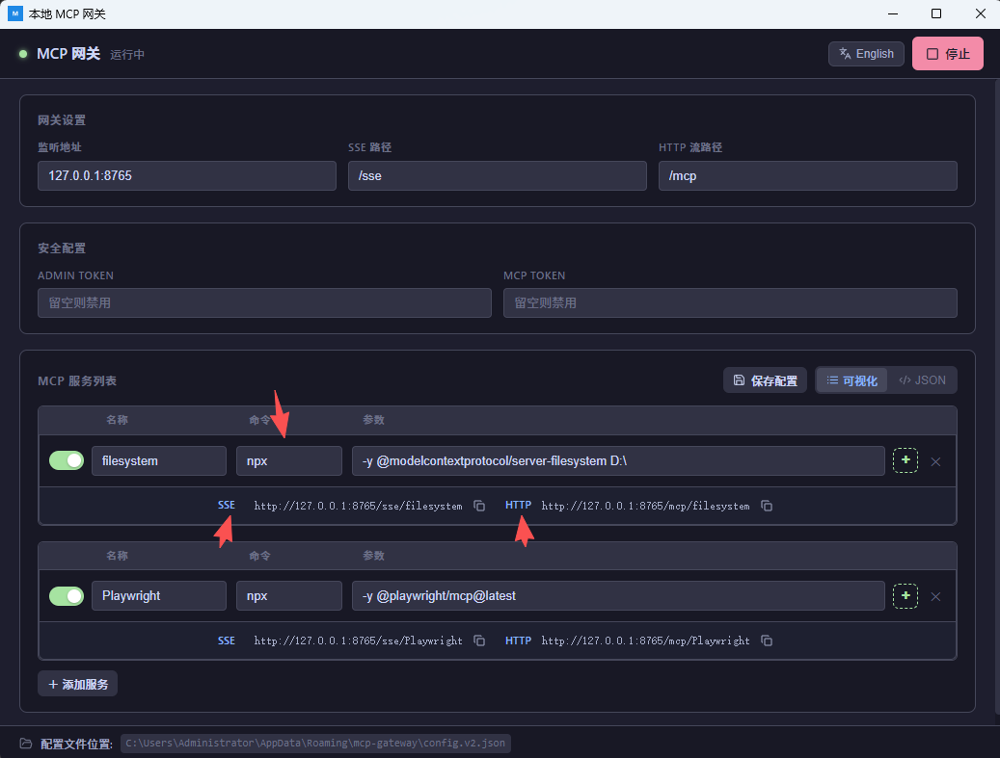

# 本地 MCP 网关

MCP Gateway 是一个 MCP（Model Context Protocol）服务器网关。  
它把多个 MCP Server 统一接入到一个入口，提供代理转发、认证和管理 API，方便你集中管理和使用。

> 最常见的用途就是将本地stdio协议变成远程MCP协议，再配合浏览器插件实现网页版ai聊天界面使用MCP工具的效果。

## 1. 界面怎么填

### 网关设置

- `监听地址`：网关监听的地址和端口，例如 `127.0.0.1:8765`
- `SSE 路径`：SSE 访问路径
- `HTTP 流路径`：Streamable HTTP 访问路径

最终访问地址规则：

- `SSE`: `http://<监听地址><SSE路径>/<服务名>`
- `HTTP`: `http://<监听地址><HTTP路径>/<服务名>`

按截图示例，`filesystem` 服务会生成：

- `http://127.0.0.1:8765/sse/filesystem`
- `http://127.0.0.1:8765/mcp/filesystem`

### 安全配置

- `ADMIN TOKEN`：管理接口令牌（留空则不启用）
- `MCP TOKEN`：MCP 调用令牌（留空则不启用）

如果你在本机调试，两个都可以先留空；要对外开放时建议设置随机长 token。

### MCP 服务列表

每一行代表一个 MCP 服务：

- 开关：启用/禁用该服务
- `名称`：服务名（会出现在 URL 末尾）
- `命令`：启动命令（如 `npx`）
- `参数`：命令参数
- `+`：添加环境变量
- `x`：删除服务

常见示例：

1. Playwright 服务
   - 名称：`Playwright`
   - 命令：`npx`
   - 参数：`-y @playwright/mcp@latest`

## 2. 怎么使用（推荐流程）

1. 填写 `监听地址`、`SSE 路径`、`HTTP 流路径`。
2. 按需填写 `ADMIN TOKEN` 和 `MCP TOKEN`。
3. 在 `MCP 服务列表` 添加你的服务（至少要有 `名称 + 命令`）。
4. 点 `保存配置`，把配置写入本地文件。
5. 点右上角 `启动`，状态变成“运行中”即成功。
6. 复制每个服务下方生成的 `SSE` 或 `HTTP` 链接，填到你的 MCP 客户端里使用。

## 3. 可视化 / JSON 两种编辑方式

- `可视化`：表单方式，适合手动维护
- `JSON`：直接粘贴 `claude_desktop_config` 风格的 `mcpServers` 对象

两种方式可以来回切换。若 JSON 格式错误，界面会提示，且不会启动。

## 4. 配置文件位置

界面底部会显示当前配置文件位置（截图里也有）。默认路径通常是：

- Windows: `%APPDATA%\mcp-gateway\config.v2.json`
- macOS: `~/Library/Application Support/mcp-gateway/config.v2.json`
- Linux: `~/.config/mcp-gateway/config.v2.json`

## 5. 常见问题

1. 点了启动没反应/报错  
   先确认每个服务至少填写了 `名称` 和 `命令`。
2. 端口被占用  
   改一个监听端口（例如 `127.0.0.1:9876`）后重试。
3. 客户端连不上  
   检查服务是否启用，URL 是否和界面里生成的一致（尤其是路径和服务名）。
